# 性能建模理论分享

## Roofline

### gemm 计算量

#### 简单 gemm

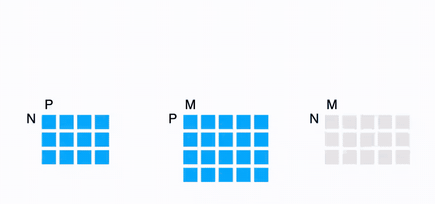

- `[M, K]`* `[K, N]`：计算量 2MNK
- `[B, M, K]`* `[K, N]`：计算量为 2BMNK
---

**为什么是 2MNK？**

因为 矩阵乘法的本质是 **批量向量内积**

计算 $x \cdot y = \sum_{i=1}^K x_i y_i$

- 需要 $K$ 次乘法 + $K - 1$ 次加法
- 总计约 $2K - 1 \approx 2K$ 次浮点运算（FLOPs）
---

#### 高维 gemm

在深度学习中，数据往往具有更高维度。例如，Transformer 中的注意力机制涉及三维甚至四维张量（如 `[batch, head, seq_len, dim]`）。此时，直接套用二维公式会出错。我们需要一套通用框架来分析任意维度下的矩阵乘法（更准确地说，是**张量缩并**，tensor contraction）。

为此，我们引入三种维度角色：

| 维度类型 | 符号颜色 | 定义 | 是否出现在输出中？ |
|---|---|---|---|
| **收缩维度（Contracting）** | 🔴 红色 | 在两个输入张量中都存在，**相乘后沿此维求和消去** | ❌ 否 |
| **批处理维度（Batching）** | 🔵 蓝色 | 在两个输入中都存在，**不参与求和，而是并行处理多个独立乘法** | ✅ 是 |
| **自由维度（Free）** | 🟢 绿色 | **仅在一个输入中出现**，直接传递到输出 | ✅ 是 |

下面举一个实际例子来说明：

设：

- $A \in \mathbb{R}^{\color{blue}{B} \times \color{green}{M} \times \color{red}{K}}$
- $B \in \mathbb{R}^{\color{blue}{B} \times \color{red}{K} \times \color{green}{N}}$
我们计算 $C = A \times B$（沿最后一个维度对 $A$ 和中间维度对 $B$ 做矩阵乘）。

逐维度分析：

- 🔵 **批处理维度（batching dimension） B **：两个张量都有，且不做求和 → 对每个 batch 独立做一次 $M \times K$ 与 $K \times N$ 的矩阵乘 → 输出保留 $B$
- 🔴 **收缩维度（contracting dimension） K**：在 $A$ 的最后一维、$B$ 的中间维 → 相乘后沿 $K$ 求和 → **不出现在输出中**
- 🟢 **自由维度（free dimension） M**（仅在 $A$ 中）、**N**（仅在 $B$ 中）→ 直接进入输出
因此，输出形状为：

$$
C \in \mathbb{R}^{\color{blue}{B} \times \color{green}{M} \times \color{green}{N}}
$$

**计算量分析**：

- 每个 batch 执行一次 $M \times K$ 与 $K \times N$ 的矩阵乘 → 耗 $2MKN$ FLOPs
- 共有 $B$ 个 batch → 总计算量为
$$
\boxed{2 \cdot \color{blue}{B} \cdot \color{green}{M} \cdot \color{green}{N} \cdot \color{red}{K}} \quad \text{FLOPs}
$$

下面给出一个 **通用规则**：

对于任意两个张量的乘法，总 FLOPs =

$$
2 \times (\text{所有批处理维度的乘积}) \times (\text{所有自由维度的乘积}) \times (\text{所有收缩维度的乘积})
$$

#### einsum

# Q: [batch, head, seq_len_q, dim]
# K: [batch, head, seq_len_k, dim]
Q = torch.randn(B, H, T, D)
K = torch.randn(B, H, S, D)
# 计算注意力分数 S = Q @ K^T，保持批和头维度并行
S = torch.einsum('bhtd,bhsd->bhts', Q, K)
- `d`（dim）在输入中出现两次，输出中未出现 → **收缩维度**（🔴）。
- `b`（batch）和 `h`（head）在两个输入和输出中都出现 → **批处理维度**（🔵）。
- `t`（seq_len_q）和 `s`（seq_len_k）分别仅出现在一个输入和输出中 → **自由维度**（🟢）。
### attention 计算量

先从一个简单的 MHA 出发，

- $B$：batch size
- $T$：seq len
- $H$：num of heads
- $D$：dimension of head
那么 attention 的总共计算量为 $4BT^2 HD$

如果考虑注意力掩码，那么计算量为 $2BT^2 HD$

每一点的计算量为 $4HD$

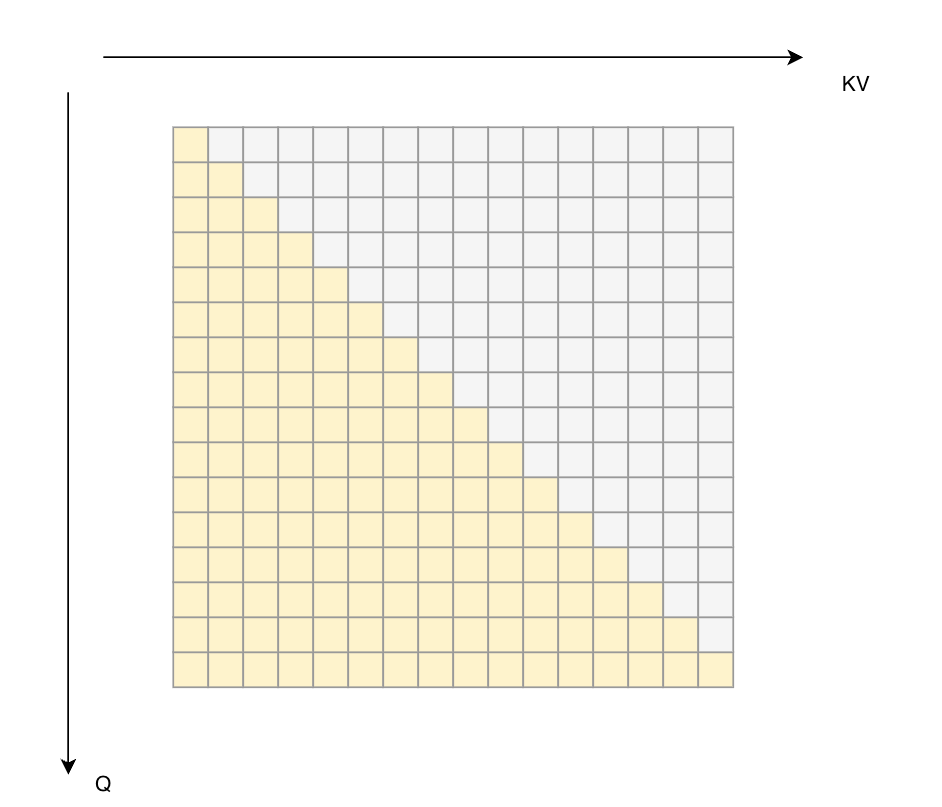

---

**需要理解 q_len 和 kv_len 这两个概念！很重要**

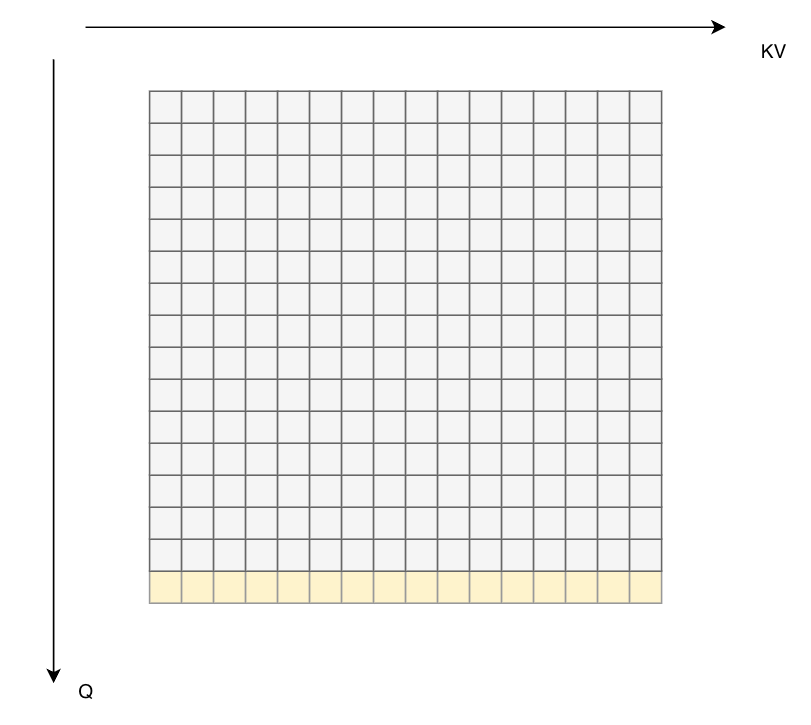

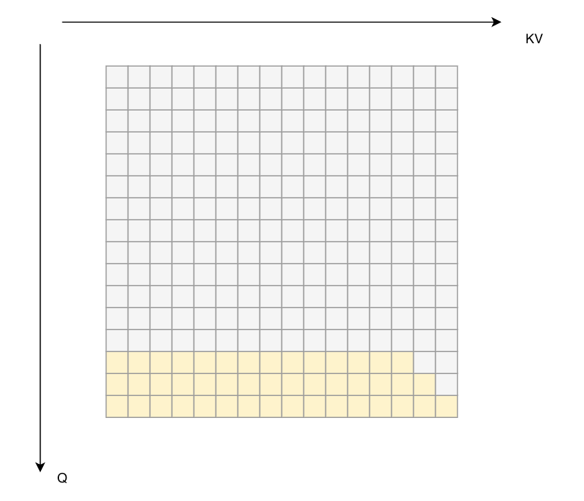

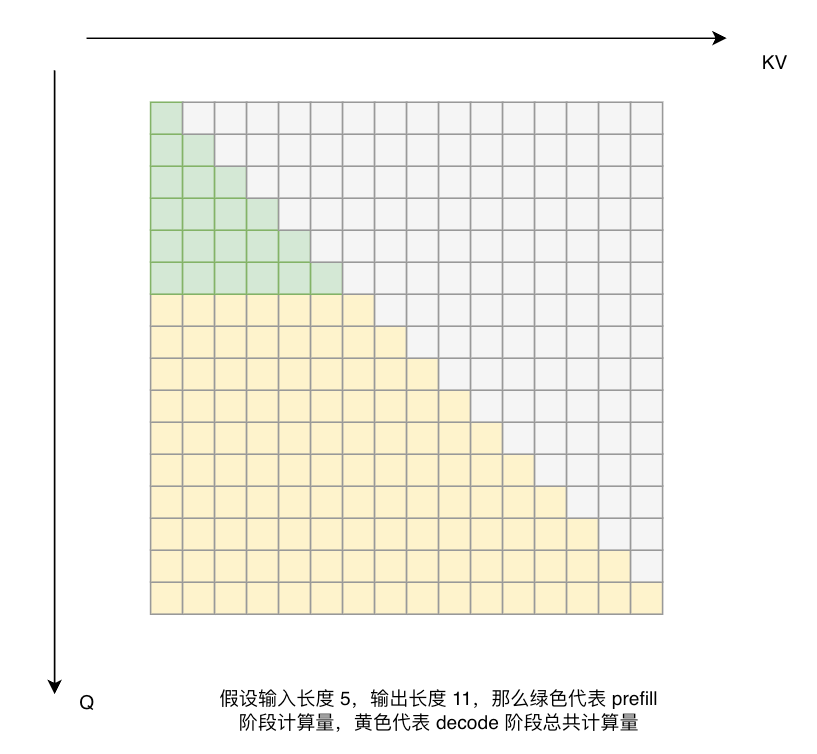

---

一个比较现代的建模方式，考虑了更多因素：

- 模型每个 head 的 qk dim 和 v dim 可能不同
- q 和 head 数量和 kv 的 head 数量可能不同（GQA、MQA）
- q_len 和 kv_len 可能不同
  - prefill 阶段一般 q_len 和 kv_len 相同，但是如果做 chunk 的话 q_len 和 kv_len 会动态变化
  - decode 阶段 q_len 取决于 mtp，不开 mtp 默认是 1，开了 mtp 会增大到 mtp_size

一个更加完备的模型如下：

- $B$：batch size
- $H$：num of q heads
- $H_{kv}$：num of kv heads
- $T$：q length
- $S$：kv length
- $d_{qk}$：qk head dim
- $d_{v}$：v head dim
那个每一个点的计算量为 $2 H (d_{qk} + d_{v})$

总共的计算量为 $[TS - \frac{1}{2} (T-1)^2] \cdot 2 H (d_{qk} + d_{v})$

### 通信原语和通信量

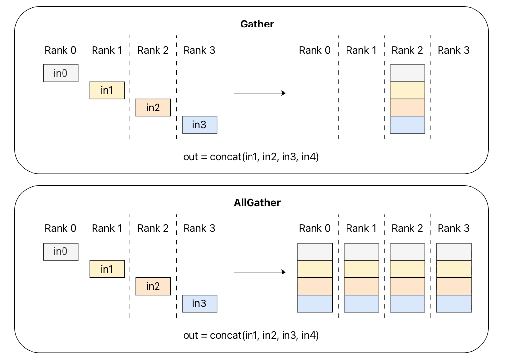

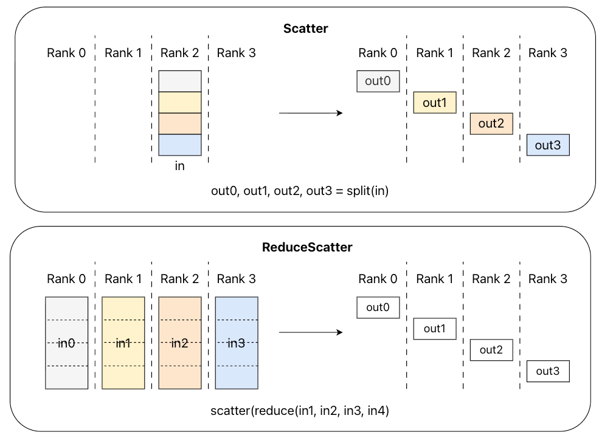

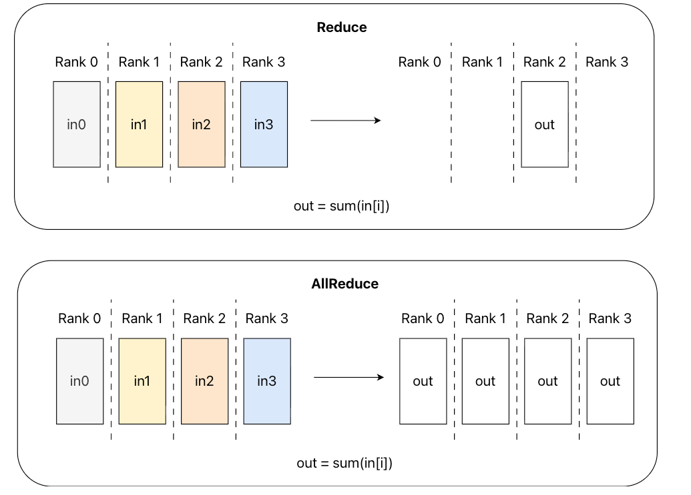

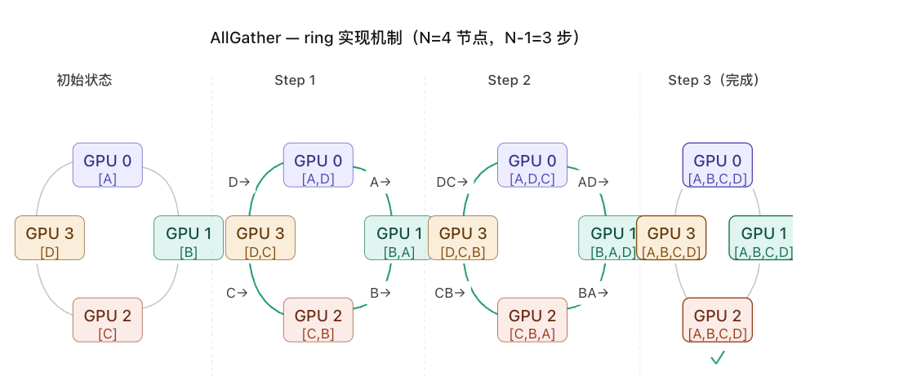

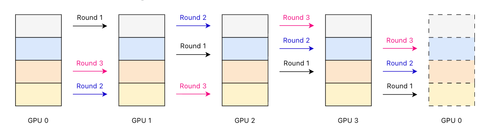

AllReduce = ReduceScatter + AllGather

$$
\begin{array}{|c|c|}
\hline
\textbf{通信类型} & \textbf{计算公式} \\[4pt]
\hline
\textbf{all\_reduce (ring)} & 2 \times (P-1) \times \text{local\_bytes} \\[8pt]
\hline
\textbf{all\_gather (ring)} & (P-1) \times \text{local\_bytes} \\[8pt]
\hline
\textbf{reduce\_scatter} & (P-1) \times \text{local\_bytes} \\[8pt]
\hline
\textbf{dispatch (MoE)} & \text{tokens} \times (\text{moe\_top\_k}-1) \times \text{dim} \times \text{dbytes} \\[8pt]
\hline
\textbf{combine (MoE)} & \text{tokens} \times (\text{moe\_top\_k}-1) \times \text{dim} \times \text{dbytes} \\[8pt]
\hline
\end{array}
$$

### 硬件性能

| GPU 型号 | BF16 TFLOPS | FP8 TFLOPS | FP4 TFLOPS | HBM 带宽 (GB/s) | NVLink 带宽 (GB/s) | IB 带宽 (GB/s) | 单节点 GPU 数量 |
|---|---|---|---|---|---|---|---|
| H800 | 989 | 1979 | 0 | 3350 | 900 | 50 | 8 |
| H100 | 989 | 1979 | 0 | 3350 | 900 | 50 | 8 |
| H200 | 989 | 1979 | 0 | 4800 | 900 | 50 | 8 |
| B200 | 2250 | 4500 | 9000 | 7700 | 1800 | 50 | 8 |
| GB200 | 2500 | 5000 | 10000 | 8000 | 1800 | 50 | 8 |
| GB200_NVL72 | 2500 | 5000 | 10000 | 8000 | 1800 | 50 | 72 |

### 计算访存比

计算访存比（Arithmetic Intensity，也叫做 Compute-to-Memory Ratio）的 **定义**如下：算法执行过程中，每传输 1 字节数据所能完成的浮点运算数量，也就是：

$$
\begin{equation}
\text{Arithmetic Intensity} = \frac{\text{Computation FLOPs}}{\text{Communication Bytes}}
\end{equation}
$$

也就是说，**计算强度**刻画了 “**每字节数据能榨出多少 FLOPs**”。从一阶近似的角度看：

- 算术强度高 → 计算占主导，$T_{\text{math}} \gg T_{\text{comms}}$，算力利用率高；
- 算术强度低 → 通信占主导，系统花大量时间在搬数据上，FLOPs 难以充分发挥。
对于一套具体硬件而言，存在一个“分界点”，即硬件的**峰值算术强度**，它由计算峰值与带宽峰值之比决定：

$$
\text{Peak Intensity} = \frac{\text{Accelerator FLOPs/s}}{\text{Bandwidth Bytes/s}}
$$

---

> 不断增加一个 kernel 的计算量，计算强度不会无限增加，增加到计算访存比后，kernel 进入计算瓶颈
> 

- memory bound
  - 增加计算量，时间基本不变/增加很少
  - 增加访存量，时间线性增加
- compute bound
  - 增加访存量，时间基本不变
  - 增加计算量，时间线形增加
### 算子计算访存比分析

#### gemm

来看一个即将成为我们最常用的算法：矩阵乘法（简称 matmul）。记作 $X * Y \rightarrow Z$，其中：

- $X$ 的形状为 $\text{bf16}[M, K]$
- $Y$ 的形状为 $\text{bf16}[K, N]$
- $Z$ 的形状为 $\text{bf16}[M, N]$
执行该矩阵乘法时，需要：

- 加载数据量：$2MK + 2KN$ 字节
- 浮点运算次数：$2MNK$ 次
- 写回结果量：$2KN$ 字节
$$
\begin{aligned}
\text{计算访存比} &= \frac{MNK}{MN + NK + MK} \\\
&= \frac{NK}{N + \frac{NK}{M} + K}
\end{aligned}
$$

当 $M \to \infty$ 时，$\dfrac{NK}{M} \to 0$

$$
\frac{NK}{N + K}
$$

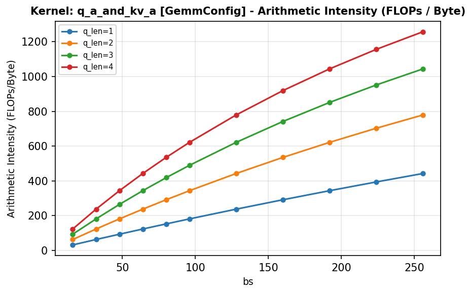

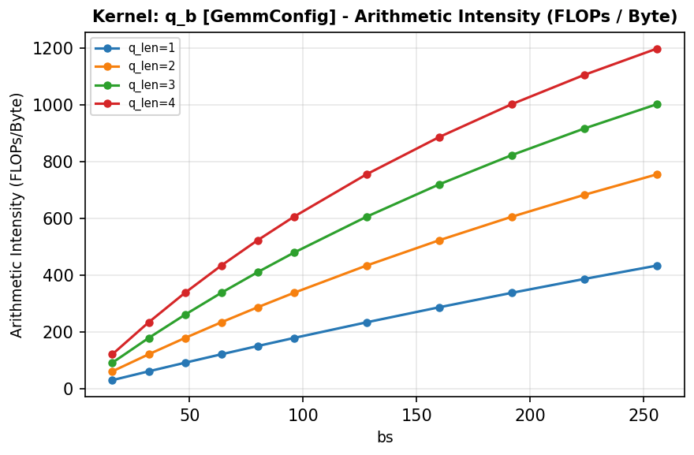

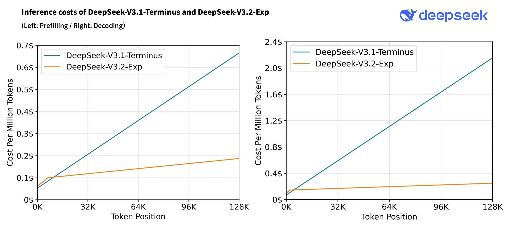

#### attention

$$
\begin{aligned}
\frac{B T S \cdot 2H (d_{qk}+d_v)}{B\left(T H d_{qk} + S H_{kv}(d_{qk}+d_v) + T H d_v\right)}
&= \frac{B T S \cdot 2H (d_{qk}+d_v)}{B\left(T H (d_{qk}+d_v) + S H_{kv}(d_{qk}+d_v)\right)} \\\
&= \frac{B T S \cdot 2H (d_{qk}+d_v)}{B (d_{qk}+d_v)\left(T H + S H_{kv}\right)} \\\
&= \frac{2 H T S}{T H + S H_{kv}} \\\
&= \frac{2 T S}{T + S \cdot \frac{H_{kv}}{H}} \\\
&= \frac{2 T}{\frac{T}{S} + \frac{H_{kv}}{H}}
\end{aligned}
$$

在 prefill 阶段，$T = S$，上式可以化简为：

$$
\frac{2T}{1+G} \sim O(T)
$$

在 decode 阶段，$\frac{T}{S}$ 接近于 $0$，上式可以化简为：

$$
\frac{2TH}{H_{kv}} = 2TG \sim O(1)
$$

所以 prefill 阶段 attention 的计算访存比随着序列长度不断增长而增大，而 decode 阶段计算访存比为一个定值，这也比较直观：

- prefill 阶段计算量复杂度为 $O(T^2)$，访存量为 $O(T)$
- decode 阶段每个 step 计算量和访存两都为 $O(T)$
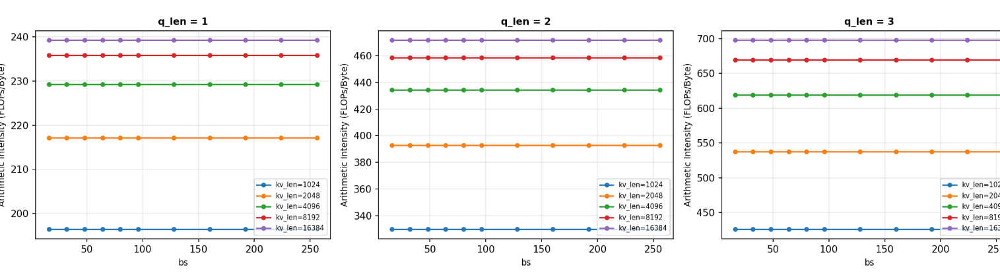

### Transformer

一个使用 GQA + MLP 的模型：

| Symbol | Dimension |
|---|---|
| $B$ | batch size |
| $L$ | number of layers |
| $T$ | sequence length (query) |
| $S$ | sequence length (key value) |
| $V$ | vocab |
| $D$ | embedding dimension |
| $F$ | MLP intermediate dimension |
| $H$ | attention head dimension |
| $N$ | number of query heads |
| $K$ | number of key/value heads |
| $G$ | q heads per kv head ( $N // K$ ) |

## MLA

**MLA 核心就一句话：**在 decode 阶段能尽量少的保存 kv cache，同时 **在数学层面上 **恢复 MHA 的效果。

对于正常 MHA/MQA/GQA，$QKV$直接通过 qkv_proj 得到：

$[Q, K, V] = X W_{qkv}$

MLA 先降维再升维：

$c_{q} = X W_{qa} \quad Q = c_{q} W_{qb}$

$c_{KV} = X W_{kva} \quad [K, V] = c_{KV} W_{kvb}$

### normal vs absorb

$$
\begin{aligned}
\text{MHA 路径} &= \text{softmax}\left( \frac{QK^{T}}{\sqrt{k}} \right) V \\\
&= \text{softmax}\left( \frac{c_{q} W_{qb} (c_{KV} W_{kb})^T}{\sqrt{k}} \right) (c_{KV} W_{vb})
\end{aligned}
$$

$$
\begin{aligned}
\text{MQA 路径} &= \text{softmax}\left( \frac{QK^{T}}{\sqrt{k}} \right) V \\\
&= \text{softmax}\left( \frac{c_{q} W_{qb} (c_{KV} W_{kb})^T}{\sqrt{k}} \right) c_{KV} W_{vb} \\\
&= (\text{softmax}\left( \frac{(c_{q} W_{qb} W_{kb}^T) c_{KV}^T}{\sqrt{k}} \right) c_{KV}) W_{vb}
\end{aligned}
$$

> 当然，这里是简化过的公式，实际上 MLA 中关于 rope 的处理比较复杂，这里不考虑这个部分：
> 
> - k_rope_dim = 64，所有 head 的 K 共享一个 rope 部分

**两种方式的差异在哪里？**

记得这句话：**计算路径的改变往往意味着计算量的差异**

举个简单例子，矩阵乘法有**结合率**，$A (BC)$和 $(AB) C$的计算量是不一样的，但是其计算结果是一致的。

再举个例子，对于 Attention，只要我们将 softmax 拿掉，即从 $\text{softmax}(Q K^{T}) V$变成 $QK^{T}V = Q(K^{T} V)$，将 $K^{T}$和 $V$先结合计算，总体的计算复杂度就从 $O(T^2 D)$变成了 $O(T D^2 )$，计算量不再随着序列长度呈二次方增长，就这是**线性注意力**。

同样，MHA 和 MQA 的计算路径改变也意味着计算量的变化。

那么：

- 为什么 prefill 用 MHA，decode 阶段用 MQA
- 为什么 cp + dsa 又要用 MQA

假设用 $T$ 表示 q_len，用 $S$ 表示 kv_len：

$$
\begin{aligned}
&\text{MQA 和 MHA 共通的部分} \\\
&\quad \text{flops\_q\_a\_and\_kv\_a}: \quad \text{T} \times 7168 \times (1536 + 512 + 64) \\\
&\quad \text{flops\_qb}: \quad \text{T} \times 1536 \times 128 \times 192 \\\
&\quad \text{flops\_oproj}: \quad \text{T} \times 128 \times 128 \times 7168 \\\
\\\
&\text{MHA 路径} \\\
&\quad \text{flops\_kb}: \quad \text{S} \times 512 \times 128 \times 128 \\\
&\quad \text{flops\_vb}: \quad \text{S} \times 512 \times 128 \times 128 \\\
&\quad \text{flops\_mha}: \quad 128 \times (\text{T} \times \text{S} \times 192 + \text{T} \times \text{S} \times 128) \\\
\\\
&\text{MQA 路径} \\\
&\quad \text{flops\_absorb\_kb}: \quad \text{T} \times 128 \times 128 \times 512 \\\
&\quad \text{flops\_absorb\_vb}: \quad \text{T} \times 128 \times 512 \times 128 \\\
&\quad \text{flops\_mqa}: \quad 128 \times (\text{T} \times \text{S} \times 576 + \text{T} \times \text{S} \times 512)
\end{aligned}
$$

ok，再给出定性的差别：

- 在 prefill 阶段，如果用 MQA，除了 attention 的计算量变大 3 倍，其他无差别，因为 prefill 阶段 q_len == kv_len
- 在 decode 阶段，使用 MQA，attention 计算量虽然变大了，但是由于 decode 阶段 q_len 远小于 kv_len，所以 kv_b 的计算量被省下来了
### Indexer

$$
\begin{aligned}
q_{\text{fp8}} &: (Q, H, d) \quad \text{多头 query} \\\
k_{\text{fp8}} &: (K, d) \quad \text{单头 key (MQA)} \\\
\text{weights} &: (Q, H) \quad \text{per-head gate} \\\
\\\
\text{GEMM} &: (Q \times H, d) \; @ \; (K, d)^T \rightarrow (Q \times H, K) \quad \text{per-head dot products} \\\
\text{ReLU} &: (Q \times H, K) \quad \text{截断负值} \\\
\times \text{weight} &: (Q \times H, K) \quad \text{乘 per-head gate} \\\
\Sigma_h &: (Q \times H, K) \rightarrow (Q, K) \quad \text{跨 head 求和（reduce sum）} \\\
\times k_{\text{scale}} &: (Q, K) \quad \text{乘 KV 的 FP8 反量化 scale} \\\
\\\
\text{输出} &: \text{logits} \; (Q, K) \; \text{float32}
\end{aligned}
$$

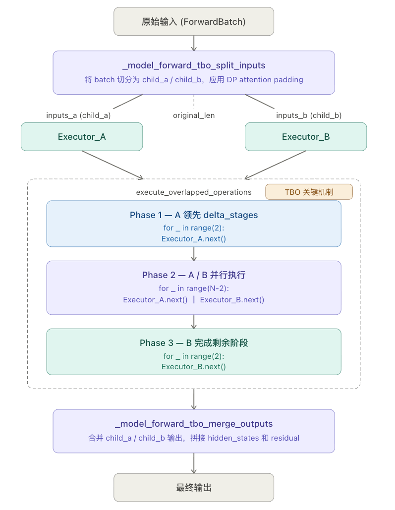

通过一个小型的 $Q @ K$为每个 q 选择最多 2048 个 kv，那么 decode 阶段每个 step 的计算量就变成了：

$4BT \cdot min(S, W) \cdot NH$，其中 $W=2048$表示 window size。

但是 indexer 阶段每个 step 的计算复杂度还是 $O(S)$的，但是 indexer 本身计算量更小，所以斜率增长更小。

## TBO

目的：多机中 dispatch/combine 通信时间长，这一部分时间机器算力被浪费，可以做 计算/通信 overlap 来掩盖这一部分时间。

实现方案：将一个 bs 拆分为两个 microbatch B1 和 B2，两个 microbatch 走独立计算流，没有数据依赖，通过 **流程编排** 实现 overlap。

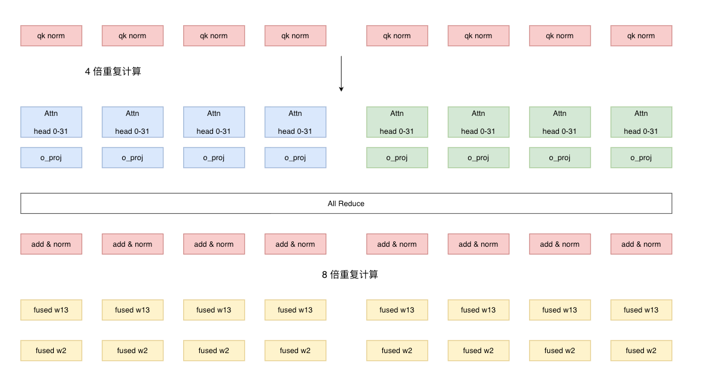

> **重要**：技术方法各有权衡，关键在于根据场景衡量优势和劣势。
> 

双流有优势和劣势，只有当 **优势 > 劣势的时候才有收益**

- **优势**：dispatch 和 combine 被计算 overlap 掉的时间
- **劣势**：计算会裂化
所以双流的**收益点：通信被掩盖的时间 >  计算裂化带来的损耗**

以 mimo v2 flash 的 decode 上的 swa 层为例说明：

| Annotation | d_bs8_4k | d_bs16_4k | d_bs24_4k | d_bs32_4k | d_bs40_4k | d_bs48_4k | d_bs64_4k | d_bs80_4k | d_bs96_4k | d_bs112_4k | d_bs128_4k | d_bs160_4k | d_bs176_4k | d_bs192_4k |
|---|---|---|---|---|---|---|---|---|---|---|---|---|---|---|
| layer_total | 250.9 | 286.9 | 337.0 | 343.242 | 376.9 | 381.6 | 399.9 | 422.9 | 433.1 | 452.4 | 465.2 | 508.126 | 522.7 | 532.2 |
| swa_qkv_proj | 13.2 | 13.7 | 13.7 | 13.5 | 13.3 | 14.0 | 13.3 | 14.1 | 14.2 | 14.0 | 14.5 | 19.4 | 19.0 | 20.0 |
| q_k_rope | 4.1 | 3.8 | 3.8 | 3.7 | 3.9 | 4.0 | 3.9 | 4.0 | 4.0 | 4.2 | 4.1 | 4.1 | 4.3 | 4.7 |
| v_scale | 3.0 | 3.1 | 3.1 | 3.1 | 3.0 | 3.2 | 3.2 | 3.2 | 3.2 | 3.4 | 3.1 | 3.1 | 3.1 | 3.3 |
| translate_loc_from_full_to_swa | 4.00 | 4.4 | 4.0 | 4.26 | 4.0 | 4.3 | 4.1 | 4.1 | 4.1 | 4.3 | 4.5 | 5.6 | 5.3 | 5.6 |
| set_kv_buffer | 12.64 | 14.0 | 12.7 | 12.61 | 12.6 | 13.6 | 13.7 | 12.7 | 13.2 | 13.4 | 13.4 | 14.5 | 14.0 | 14.0 |
| attn_swa | 20.7 | 21.9 | 32.4 | 35.4 | 44.2 | 46.4 | 58.8 | 69.1 | 79.9 | 91.6 | 99.6 | 122.8 | 133.2 | 137.7 |
| o_proj | 13.4 | 13.2 | 13.6 | 13.5 | 15.0 | 14.3 | 16.2 | 17.4 | 16.0 | 16.1 | 16.4 | 17.8 | 16.8 | 17.6 |
| fused_add_norm | 3.6 | 3.3 | 3.5 | 3.4 | 3.4 | 7.3 | 3.4 | 3.4 | 3.4 | 3.5 | 3.5 | 3.8 | 3.8 | 3.8 |
| moe_gate | 17.15 | 17.4 | 34.5 | 34.53 | 37.9 | 35.7 | 37.3 | 37.1 | 37.5 | 37.0 | 37.3 | 41.1 | 41.1 | 40.7 |
| biased_grouped_topk | 40.13 | 41.0 | 39.5 | 39.24 | 40.1 | 40.7 | 39.2 | 39.0 | 40.0 | 40.2 | 40.0 | 42.6 | 42.2 | 42.2 |
| dispatch | 17.70 | 20.6 | 25.3 | 22.40 | 21.2 | 23.0 | 25.2 | 24.4 | 26.7 | 25.5 | 26.0 | 28.1 | 29.9 | 29.2 |
| w13 | 24.6 | 39.5 | 50.6 | 64.1 | 80.2 | 79.6 | 78.0 | 88.5 | 85.8 | 88.5 | 93.0 | 92.9 | 92.4 | 92.5 |
| fused_silu_mul | 9.6 | 9.7 | 9.7 | 9.8 | 9.8 | 10.8 | 9.6 | 10.2 | 9.8 | 10.4 | 10.3 | 10.6 | 10.7 | 10.8 |
| w2 | 15.8 | 24.0 | 27.5 | 36.4 | 45.6 | 42.0 | 44.5 | 48.4 | 47.1 | 48.1 | 49.1 | 25.6 | 49.5 | 50.3 |
| combine | 35.68 | 39.2 | 45.4 | 28.96 | 24.0 | 23.8 | 33.0 | 29.1 | 31.3 | 34.6 | 32.3 | 32.7 | 37.1 | 39.5 |

---

由此可以解决几个问题：

- D1, D2, D4, D10, D16 的本质区别在哪里？为什么要组大 EP？
- 为什么小 bs 下双流没有收益？
- 如何论证多机上双流收益？
- nv 为什么要推出 nvlink 72？

### 引擎关于双流的建模

通过借用 coroutine 中 yield 原语的设计理念，来实现双流的流程编排：

- yield 在这里的语义是 “让权”，如果一个 microbatch 执行 yield，就表示可以让另一个 microbatch 执行了。
return OperationsStrategy(
    deep_gemm_num_sms=None,
    tbo_delta_stages=2,
    operations=[
        attn0,
        Yield,

        attn1,
        Yield,

        dispatch_a,
        shared,
        Yield,

        dispatch_b,
        mlp,
        combine_a,
        Yield,

        combine_b,
        Yield,
    ],
)
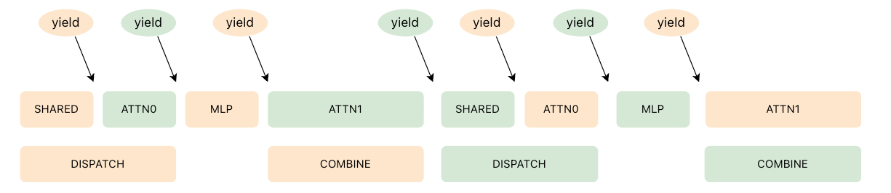

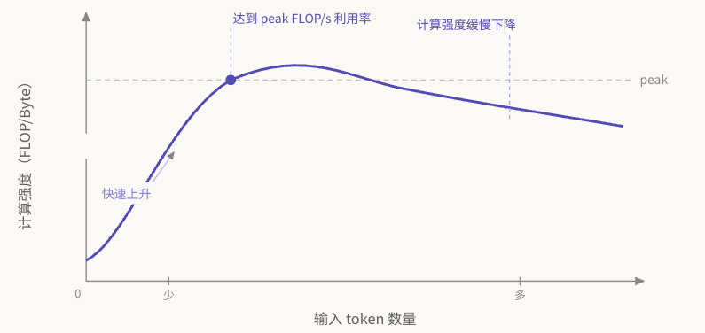

## SBO

TBO 表示将一个 batch 拆分为两个 microbatch，SBO 表示不拆 batch，调整一个 batch forward 的内部流程做 overlap，方案可以分为两类：

- 计算流 和 通信流 overlap
  - combine 和 shared overlap
- 计算流 和 计算流 overlap
  - 例子
    - q norm || k norm
    - indexer act_quant(q) || act_quant(k)
    - indexer rotate_activation(q) || rotate_activation(k)
  - 限制条件
    - decode 阶段，算力吃不满
    - 两个 overlap 的算子没有流程依赖
    - 开启 cuda graph
  - 为什么不用 kernel fusion
    - 开发成本低，代码方便维护
## MTP

mtp 从推理侧来说理念比较简单：

- 小模型很快地吐几个 token
- 大模型顺便把这几个 token 一起跑一下，相当于增大了 decode 阶段的 q_len
- 有几个通过了 verification，就接收几个

为什么有效？因为 decode 阶段是 memory bound，很多算子在 bs * 2 的时候时间基本上不会发生变化，这个顺带多算一些对于 decode 来说性价比很高。

mtp 的研究核心一直在于如何改变训练方式提高 draft 的接收率：eagle, eagle2, eagle3

- 直接预测下一个 token，还是预测最后一层的 hidden state
- 是从主模型中选一些层导出，还是说另外选一个小模型

### mtp size 的选择

根据 layer time 和 mtp accept rate 进行分析

## EP MoE vs Fused MoE

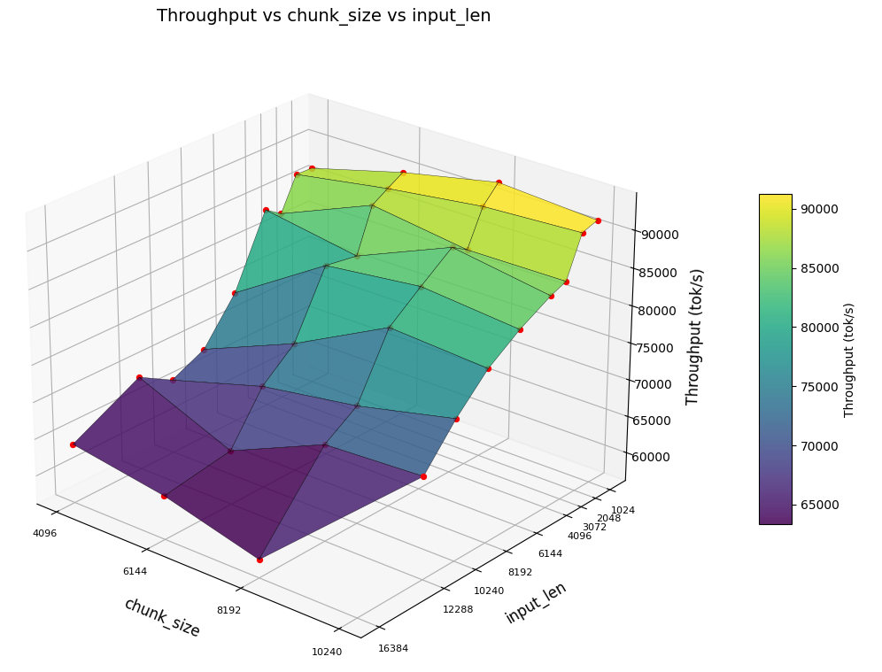

fused moe 相比于 ep moe 的**优点：**

- 没有不均衡的问题
fused moe 相比于 ep moe  的**缺点：**

- 存在重复计算的部分，计算量大 8 倍
  - moe gate
  - moe topk
  - quant（如果需要的话）
- 无法做多机部署
**差不多**的部分：

- 通信量的差异：fused moe 要大一些，需要根据 attention tp size 进行论证
  - attention tp size == 8，两者通信量差不多
    - all reduce = reduce scatter + dispatch （假设 dispatch 是 bf16 的话两者一致，实际上 deepseek dispatch 是 fp8 所以 ep moe 还是要小 1/4）
    - all reduce = combine + all gather
  - attention tp size == 1，两者通信量差不多（假设 dispatch 是 bf16 的话两者一致，实际上 deepseek dispatch 是 fp8 所以 ep moe 还是要小 1/2）
    - all gather = dispatch
    - reduce scatter = combine
**需要根据实现来分析的部分：**

- TP 模式的 bmm 和 deep gemm 的 group gemm 的比较，实际上 deep gemm 表现更好

使用真实数据来对于一下：

首先是 decode，采用 4k bs128 的场景进行对比：

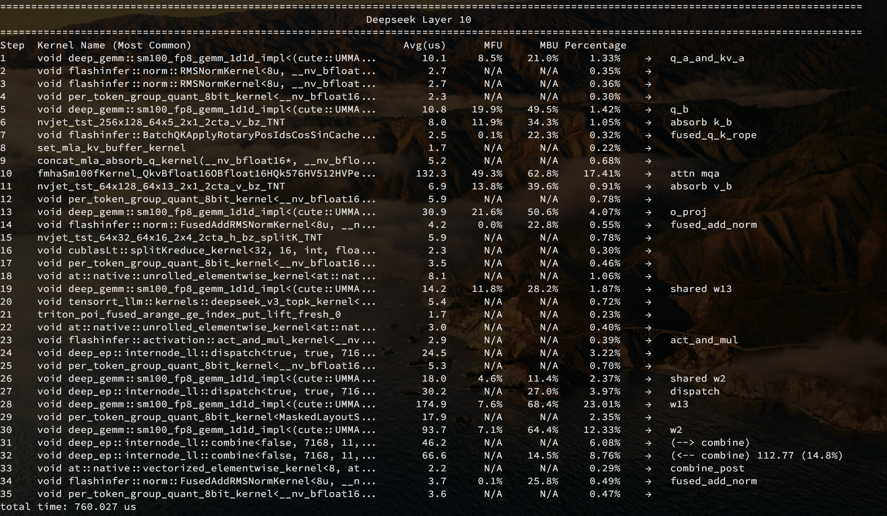

接下来是 prefill，采用 TP8 chunk48k 打满的场景进行对比：

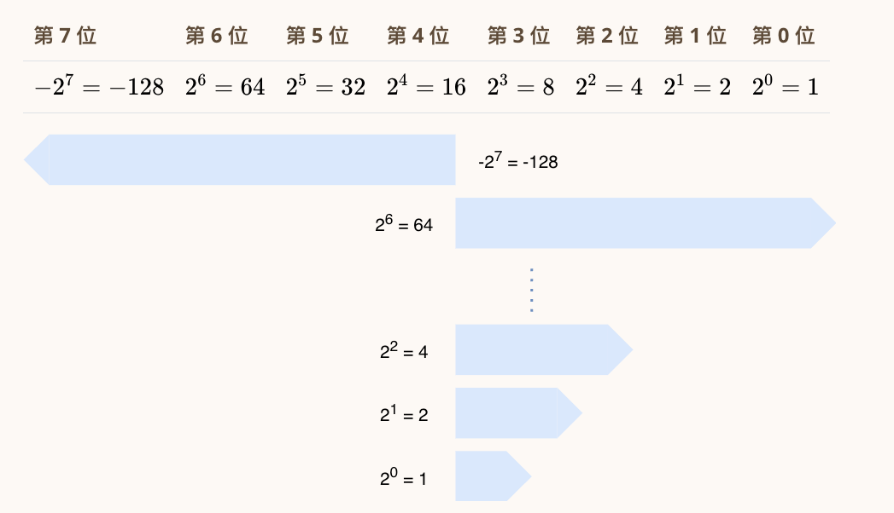

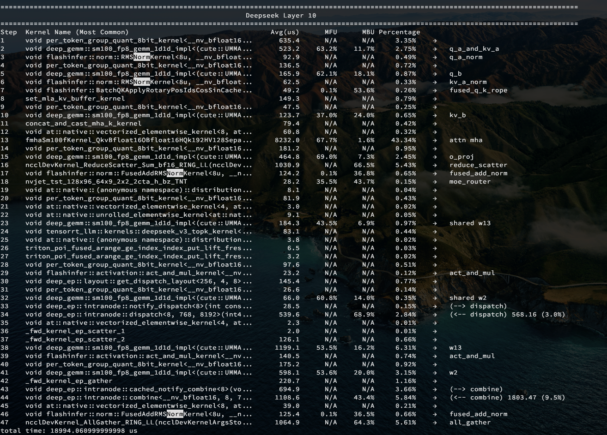

## DP Attention

先澄清一下 dp attention 的语义：

如何 attention tp_size = 8，那就是有一个 dp，就不叫 dp attention。

只有当 attention 阶段 dp_size > 1 的时候，我们才叫使用了 dp attention。

---

接下来先讨论这个问题：

- 不同 tp_size 的 attention 对于算子的计算效率是否有影响？
- 不同 tp_size 的 attention 在流程上会有哪些差异？

假设使用 fused_moe，对于一下 TP4 和 TP1 的 attention 阶段：差异在于 attention tp_size > 1 时不同 rank 存在重复计算：

- TP4 的一些小算子需要额外计算：
  - q_a_and_kv_a_proj：在 MHA 的 qkv head 切分之前，每个 rank 重复计算，4 倍差距
  - norm
    - q_norm和 k_norm：4 倍差距
    - attention 之后的 fused_add_norm：8 倍差距。
    - MoE 之后的 fused_add_norm：4 倍差距。
  - 一些其他小算子也存在额外计算
    - set_mla_kv_buffer
    - dp_scatter 中的 trtion_mem_cpy 和 local_tokens.fill_(0)

当然讨论这个问题还有更多变量：

- 使用的是 ep moe 还是 fused moe？
- attention 用的是 MHA、MQA 还是 GQA？
## Blockwise Attn Theory

attention 中的 “分治”：

- 每次只算一部分 attention
- 计算下一部分的时候 merge 上一部分的结果（切 KV 需要）
- 不断迭代直到完成所有 attention 的计算
递归地 merge attention 的关键：如何处理 softmax 这个概率归一的非线性操作

### q & kv block attention

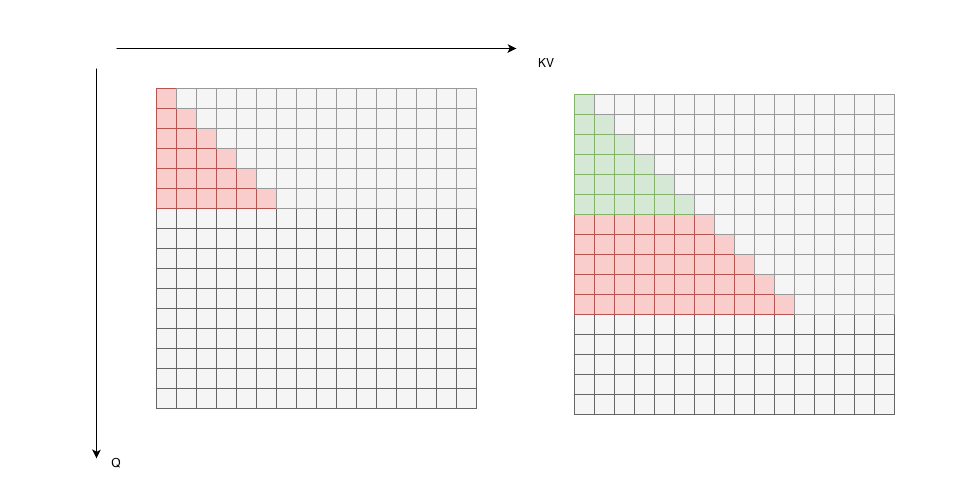

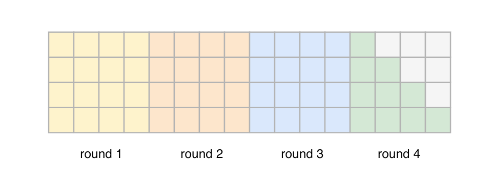

关于“KV chunked attention”和“Q chunked attention”这两个术语，目前学术界并没有统一的定义，不同文献或讨论中常常出现名称混用，容易造成理解上的混淆。为了便于后续讨论，我先对它们做一个简单的区分说明：

- **KV chunked attention**：在这种方法中，查询（Q）是已知且完整的，但由于计内存限制或其他原因，无法一次性将 Q 与所有历史的 KV 进行注意力计算。因此，将 KV 切分成多个小块，逐块与 Q 进行计算，最后合并各块的结果，从而得到完整的注意力输出。
- **Q chunked attention**：这种方法则是将查询（Q）切分成多个块，然后逐块与完整的键值（KV）进行注意力计算，最后再合并结果。
### LSE

为了更好地进行分段计算，我们引入一个重要的数学工具：**对数求和指数**（Log-Sum-Exp，简称 LSE），其定义为：

$$
\text{LSE}(x_1, x_2, \dots, x_n) = \log\left( \sum_{i=1}^{n} e^{x_i} \right)
$$

$$
\boxed{\text{softmax}(x_i) 
= e^{x_i - \text{LSE}(x)}}
$$

$$
\boxed{\frac{\partial}{\partial x_i} \text{LSE}(x) 
= \frac{e^{x_i}}{\sum_{j=1}^{n} e^{x_j}} 
= \text{softmax}(x_i)}
$$

---

### softmax 递归

在实际计算中，如果向量 $X$ 很长，我们可以将其分成若干段依次处理。假设将 $X$ 分为 $n$ 段：

$$
X = [X_1, X_2, \dots, X_n]
$$

**需要明确的一些概念**

- $X, X_1, X_2$ 这些都是数组
- $\text{LSE}(X_1), \text{LSE}(X_2)$ 这种是常量
- $x_i$ 是一个变量
- $\text{softmax}_{1}(x_i)$ 这种是一个函数
**第一步：处理第一段 **$X_1$

我们只能基于当前段的信息计算：

$$
\text{lse}_1 = \log\left( \sum_{x \in X_1} e^{x} \right)
$$

$$
\text{softmax}_1(x_i) = e^{x_i - \text{lse}_1}, \quad x_i \in X_1
$$

**第二步：处理第二段 **$X_2$

当读到第二段时，我们需要更新之前的结果。计算第二段的 LSE：

$$
\text{lse}_2 = \log\left( \sum_{x \in X_2} e^{x} \right)
$$

此时，前两段合并后的 softmax 可以表示为：

$$
\text{softmax}_{2}(x_i) = \frac{e^{x_i}}{e^{\text{lse}_1} + e^{\text{lse}_2}} = \frac{e^{x_i - \text{lse}_1}}{1 + e^{\text{lse}_2 - \text{lse}_1}}, \quad x_i \in [X_1, X_2]
$$

这等价于：

$$
\text{softmax}_{2}(x_i) = \text{softmax}_1(x_i) \cdot \frac{1}{1 + e^{\text{lse}_2 - \text{lse}_1}}
$$

若记 $\sigma(z) = \frac{1}{1 + e^{-z}}$ 为 sigmoid 函数，则上式可写为：

$$
\begin{aligned}
\text{softmax}_{2}(x_i) 
&= \text{softmax}_1(x_i) \cdot \sigma(\text{lse}_1 - \text{lse}_2) \\\
&= e^{x_i - \text{lse}_{1}} \cdot \sigma(\text{lse}_1 - \text{lse}_2)
\end{aligned}
$$

## Chunked Prefill

算子的计算强度不会随着输入 token 数量的增大而不断增大，它的增长趋势为：

- 先增长，达到 peak flops
- 再缓慢下降
### chunk size 设置

所以 chunk size 的设置是为了保证时延 和 吞吐的平衡：

- 如果 chunk size 设置得太小，算子没有达到最好的 flops
- 如果 chunk size 设置得太大，时延又比较大
关键在于如何找到这个甜蜜点，这个没有太多理论分析的空间，中间算子太多，掺杂的变量太多，直接暴力测试即可，一般会呈现如下数据：

### 变长场景

## CP vs TP

### TP

- 对于 attention 阶段：本质上是按照 head 切分，其他的 gemm 切分都是为此服务
  - qkv_proj：按照 $W_{qkv}$的列切分，这样不同的 rank 可以拿到不同的 head 的数据
  - o_proj：按照 $W_{o}$的行切分
  - all_reduce：实际上是聚合不同 head 的 residual
- 对于 moe 阶段：按照 moe_intermidiate_size 切分
### CP

#### Ring Attention

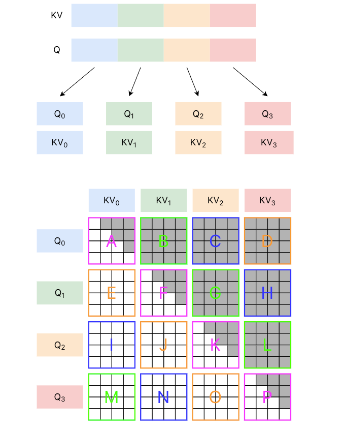

还有 Stripe Attention，也是脱胎于这种方案。

在推理场景中使用很少，主要是为了解决 单条序列太长，单卡放不下来 KV 的场景。

#### All Gather CP

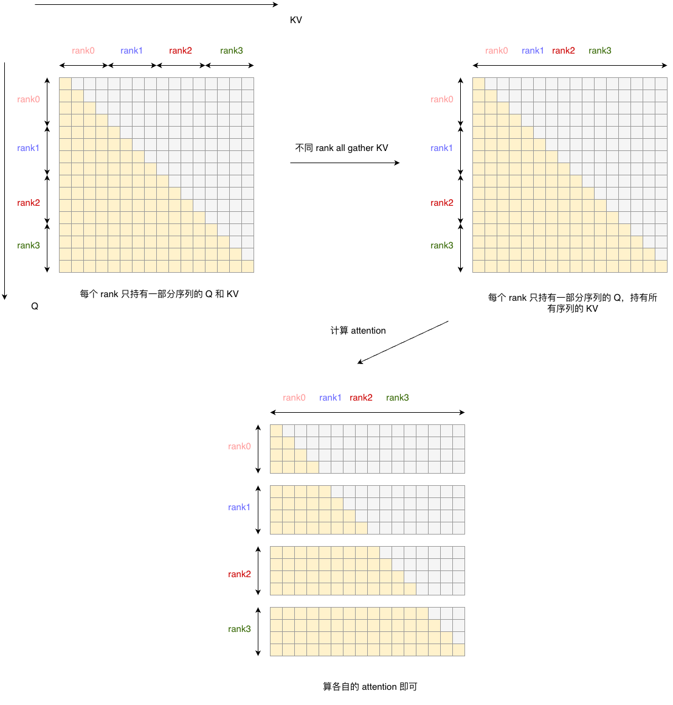

以 CP=4, in-seq-split 为例

**Step 1: 切分输入**

假设总序列长 8000 tokens，先切成 `cp_size*2 = 8` 块，再 zigzag 分配：

原始: block0 | block1 | block2 | block3 | block4 | block5 | block6 | block7
                                    ↓ zigzag 重排
rank0: block0, block7  (头+尾, 平衡 causal mask 计算量)
rank1: block1, block6
rank2: block2, block5
rank3: block3, block4
每个 rank 只处理约 1/4 的 token，各自独立过 embedding → layernorm → QKV projection。

**Step 2: AllGather KV Cache**

AllGather 之后，**每个 rank 都拥有完整的 8000 个 token 的 KV cache**。

**Step 3: 本地做完整的 Causal Attention**

每个 rank 拿自己的 Q（只有 ~2000 tokens）和完整的 KV（8000 tokens）做 attention。因为是 causal mask，所以：

- rank0 的 Q 对应 block0 和 block7 的位置，只需要 attend 到各自因果范围内的 KV
- 各 rank 独立计算，不需要多轮迭代
**Step 4: AllGather 最终输出**

---

## Quantization

### 通用量化模型

对于任意张量 (X)，量化可以抽象为：

$$
X \approx \hat{X} = s_X \cdot Q_X
$$

其中：

- $Q_X$：低精度表示（int8 / fp8 / nf4 等）
- $s_X$：scale
- $\hat{X}$：反量化后的近似值

**GEMM 的通用形式**

$$
Y = XW
$$

**量化后**

$$
X \approx s_X Q_X,\quad W \approx s_W Q_W
$$

$$
Y \approx (Q_X Q_W) \cdot (s_X s_W)
$$

**核心计算目标：**

在低精度空间完成大部分计算，同时最小化恢复到高精度的代价

$$
\text{目标：} \quad XW \approx (Q_X \cdot Q_W) \cdot (s_X \cdot s_W)
$$

### 基础分类

#### 量化对象

量化有两个对象：权重 W（weight）和 激活 A （activation）

> 默会前提：现代大模型量化，默认原始精度 ≈ BF16
> 
> 如果 W4，就是代表 weight 用 4bit，4 < 16，就是用了量化
> 
> 如果 A8，就是代表 activation 用 8bit，8 < 16，用了量化
> 

这是一个重要维度，命名惯例如 `WxAy` 表示权重 x-bit、激活 y-bit：

- **Weight-only（W4A16, W8A16）**：只量化权重，激活保持 FP16/BF16。推理时 on-the-fly 反量化权重再与 FP16 激活相乘。Kimi K2.5 就是 W4A16。
- **Weight + Activation（W8A8）**：权重和激活都量化，计算在低精度域完成（如 INT8 matmul 或 FP8 matmul），吞吐更高。
#### 粒度

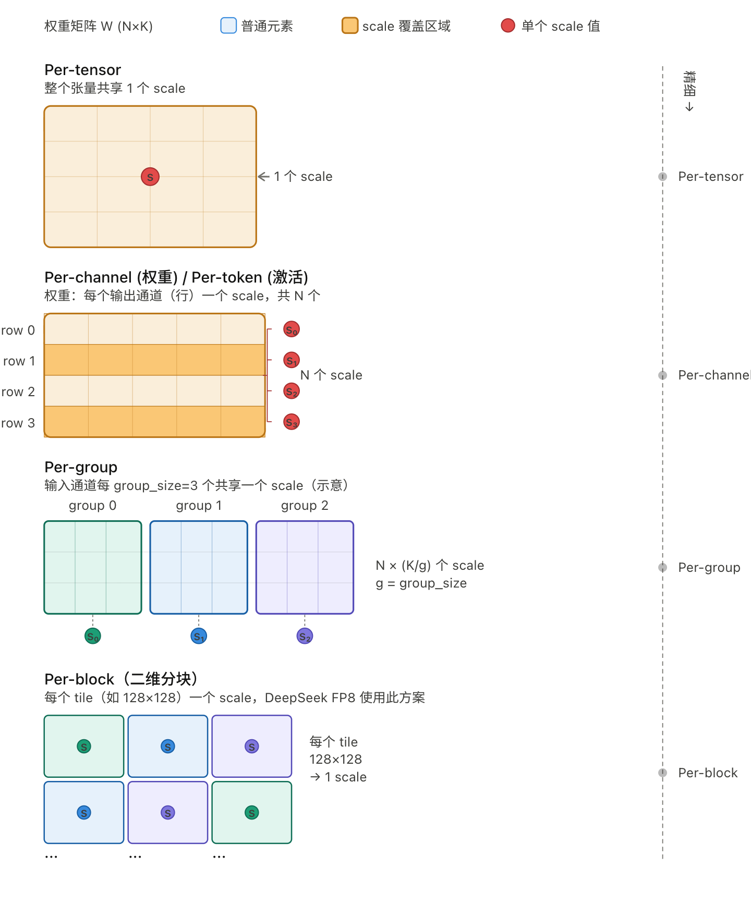

#### 数据类型

- int：补码表示
  - int8，uint8
  - int4，uint4
- 浮点数
  - fp8（e4m3，e8m0，e5m2）
  - fp4（e2m1）

先说明几个单词：

> Sign：符号位
> Exponent（E）：指数位
> Mantissa（M）：小数位
> 

| 浮点格式 | 符号位 | 指数位 | 小数位 | 量化 group size（典型值） |
|---|---|---|---|---|
| bfloat16 | 1 | 8 | 7 | 通常不分组或按层量化 |
| fp16 | 1 | 5 | 10 | 通常不分组或按层量化 |
| fp8(e4m3) | 1 | 4 | 3 | 128（常见于权重分组） |
| fp8(e5m2) | 1 | 5 | 2 | 128（常见于权重分组） |
| fp8(e8m0) | 1 | 8 | 0 | 128（blackwell 默认使用） |
| fp4(e2m1) | 1 | 2 | 1 | 32 或 64（常用于权重） |
| mxfp8 | 1 | 4 | 3 | 128（类似 fp8(e4m3)） |
| mxfp4 | 1 | 2 | 1 | 32 或 64（类似 fp4(e2m1)） |

#### 算法

还有一个维度是"怎么选 scale"：

- **RTN（Round-to-Nearest）**：直接取 min/max 算 scale，最简单
- **GPTQ**：基于 Hessian 逆矩阵逐列量化 + 误差补偿，数学上是二阶优化
- **AWQ（Activation-Aware）**：根据激活幅度给重要通道乘一个保护系数再量化，等效于调整 per-channel scale
- **SmoothQuant**：把激活的离群值"平滑"到权重上（`diag(s) × W × diag(1/s)`），使两者都更好量化
### 模型采用的量化组合

量化方案 = 粒度 × 对象 × 数据类型 × 算法

Kimi K2.5 的位置:
  粒度:   per-group (group_size = 32)
  对象:   weight-only (W4A16)
  类型:   INT4 对称 (uint4b8)

DeepSeek V3/R1 的位置:
  粒度:   Per-block 128×128
  对象:   weight+activation (W8A8)
  类型:   FP8 (e4m3)
如何判断？读一下 safetensors 的元数据：

    DeepSeek：
    • model.layers.2.self_attn.q_b_proj.weight: shape=(24576, 1536), dtype=torch.float8_e4m3fn
    • model.layers.2.self_attn.q_b_proj.weight_scale_inv: shape=(192, 12), dtype=torch.float32
    • model.layers.3.mlp.experts.0.down_proj.weight: shape=(7168, 2048), dtype=torch.float8_e4m3fn
    • model.layers.3.mlp.experts.0.down_proj.weight_scale_inv: shape=(56, 16), dtype=torch.float32

    Kimi K25：
    • language_model.model.layers.1.mlp.experts.0.down_proj.weight_packed: shape=(7168, 256), dtype=torch.int32
    • language_model.model.layers.1.mlp.experts.0.down_proj.weight_scale: shape=(7168, 64), dtype=torch.bfloat16
### FP8

deepseek 是混合精度的模型，绝大多数运算都是基于 fp8，只需要记住哪些是 bfloat16 的就行：

- absorb kb
- absorb vb
- dense mla
- moe gate
- combine
> 注意：b卡上 sparse mla 默认使用 fp8
> 

---

**量化过程：**

q_fp8, q_scale = act_quant(query, block_size, scale_fmt)  # bf16 → fp8
k_fp8, k_scale = act_quant(key, block_size, scale_fmt)    # bf16 → fp8
对每个 block (128 elements):
    amax = max(|x_i|)
    scale = amax / fp8_max         # fp8_max = 448 for e4m3
    x_fp8 = round(x / scale)       # 量化
返回的 `scale` 是 **per-block** 的 fp32 标量，用于后续反量化。

**数学上：**

$$
\begin{aligned}
\text{原始值:} \quad Q_{\text{real}} &= Q_{\text{fp8}} \times q_{\text{scale}} \\\
K_{\text{real}} &= K_{\text{fp8}} \times k_{\text{scale}} \\[6pt]
Q_{\text{real}} @ K_{\text{real}}^T &= (Q_{\text{fp8}} \times q_{\text{scale}}) @ (K_{\text{fp8}} \times k_{\text{scale}})^T \\\
&= (Q_{\text{fp8}} @ K_{\text{fp8}}^T) \times q_{\text{scale}} \times k_{\text{scale}}
\end{aligned}
$$

所以 fp8 GEMM 的结果需要乘上**两个 scale**才能得到正确的数值。

##### 硬件级操作流程

1. **乘法**：Tensor Core 的专用电路直接处理 FP8 输入，执行 `fp8 * fp8`的乘法。这个乘法操作是“原生”的，硬件有专门为 FP8 设计的乘法器单元，效率极高。
1. **结果扩展与累加**：乘法产生的原始乘积结果（其位宽大于 FP8）会被**立即转换/扩展到更高精度**（例如 FP16 或直接到 FP32 的中间表示），然后送入 FP32 累加器阵列。
1. **累加器**：所有扩展后的部分积在 FP32 累加器中进行求和。如指令 `GMMA::MMA_64x64x32_F32E4M3E4M3_SS`所示，`F32`明确指明了累加器精度为 FP32。
##### 计算复杂度

(M, K) @ (K, N) 的 FP8 GEMM:

- 矩阵乘法: $2 \times M \times N \times K$ 次 FP8 乘加
  - $O(M \cdot N \cdot K)$，tensor core 执行
- 乘 scale: $M \times N$ 次 FP32 乘法
  - $O(M \cdot N)$，elementwise
scale 的计算量比矩阵乘法少了一个 K 的量级（K 通常是几千到上万），占比可以忽略。

所以衡量 FP8 GEMM 的 MFU 时，只算 2MNK 的 FP8 FLOPS，用 FP8 峰值算力做分母，scale 的 elementwise 开销不计入。

## Tips

- 难点在哪
  - 知识体系太庞杂
  - 需要一定想象力
  - 高度经验依赖：马太效应
  - 主动挖掘的能力：what → why → how
  - 数学基础
- 深度 vs 广度
  - 拼积木的人
  - 做积木的人
  - 市场需要解决问题的 AI 或者 人
- AI 可以帮助大家成长
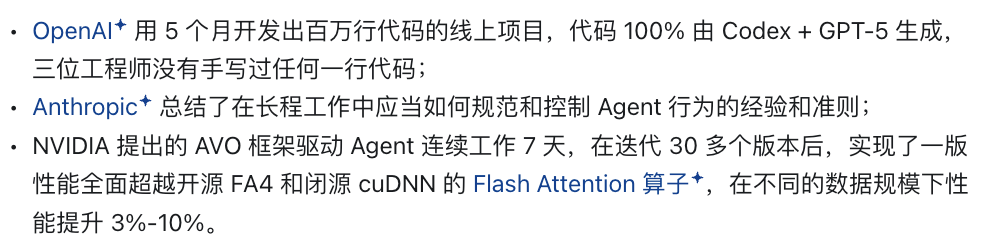
